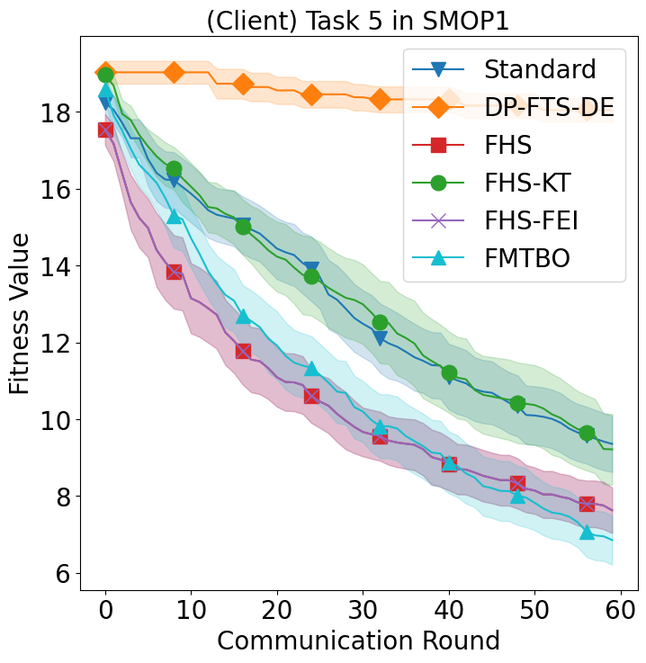
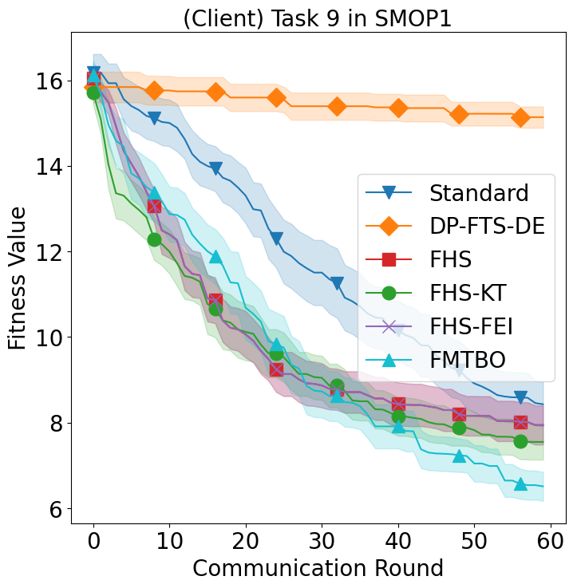
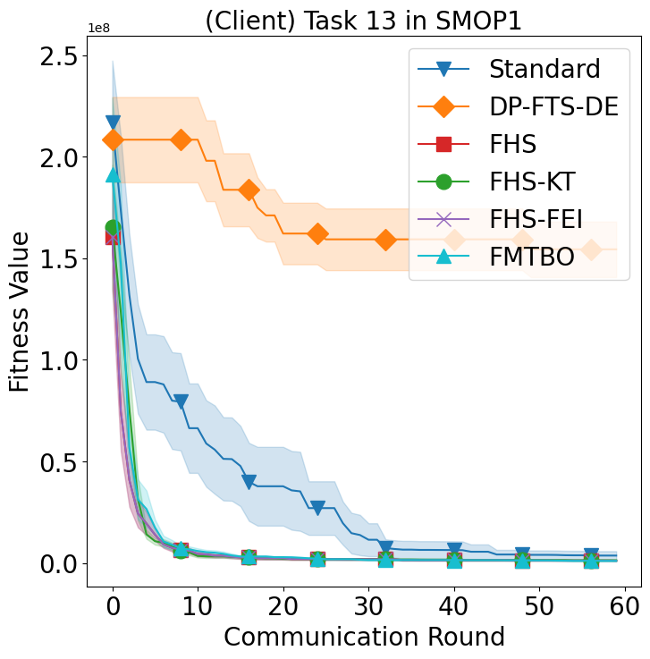
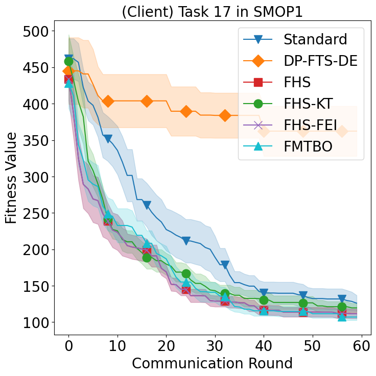

# Federated Many-Task Bayesian Optimization
 
This is the code implementation of our paper "Federated Many-Task Bayesian Optimization". You can find our paper through the early access [TEVC](https://ieeexplore.ieee.org/document/10141991)

## Reference
***H. Zhu, X. Wang and Y. Jin, "Federated Many-Task Bayesian Optimization," in IEEE Transactions on Evolutionary Computation, doi: 10.1109/TEVC.2023.3279775.***

## Quick Start
You can easily run the code by .sh files in the folder of experiments.

sh mtp.sh: FHS, FHS-FEI

sh mtpkt.sh: FHS-KT, FMTBO

## Non-IID simulations
Remove the argument --iid and set --np_per_dim for number of partitions per feature dimension

## SOP
Contain single-objective bencmark problems: **Griewank, Rastrigin, Ackley, Schwefel, Sphere, Rosenbrock, Weierstrass, Ellipsoid**

## Multi/Many Task problems
The sythetic many-task problems include 18 tasks are generated by rotation and shift matrices.

## Deploy
Contain the implementations of the server and clients. 

Unlike the paper "A federated data-driven evolutionary
algorithm" (https://arxiv.org/pdf/2102.08288.pdf) samples solutions on a single server for each round, our approach optimizes and finds the solution on each client.

## Some Figures
The average results of SMOP1 for task 5, 9, 13 and 17 in our paper.

  
  
  
  

